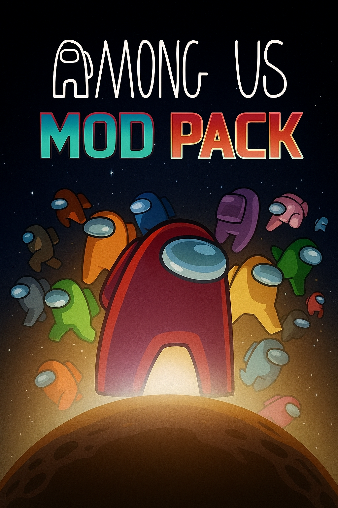

# Among Us Mod Pack

These repo contains a few Among Us Mod Packs made by me. Note : These mods have not been made by me and the links of the mods which I used are given below and full credit goes to the devs of these mods.For info of all the mod packs in this repo along with all the mods in them click [here](https://github.com/superidol1890/Among-Us-Mod-Pack#Mods).

  

# Supported Platforms

Before you download anything, make sure your platform is supported:

|    Among Us Platform   |            Supported                |
|:----------------------:|:-----------------------------------:|
|    Steam               |               ✅                   |
|    Epic Games          |               ✅                   |
|    itch.io             |               ✅                   |
|    Microsoft Store     |               ✅                   |
|    Cracked             |               ❔ (rarely works)    |
|    Goggle Play         |               ❌                   |
|    App Store           |               ❌                   |
|    Nintendo Switch     |               ❌                   |
|    Playstation         |               ❌                   |
|    Xbox                |               ❌                   |

# Supported Game Versions

|    Among Us Version    |          AUModPack Version          |
|:----------------------:|:-----------------------------------:|
| `17.1.0` (`2025.11.18`)| [v1.5.0](https://github.com/superidol1890/Among-Us-Mod-Pack/releases/tag/v1.5.0) |
| `17.0.1` (`2025.10.14`)| [v1.4.0](https://github.com/superidol1890/Among-Us-Mod-Pack/releases/tag/v1.4.0) |
| `17.0.0` (`2025.9.9`)  | [v1.3.0](https://github.com/superidol1890/Among-Us-Mod-Pack/releases/tag/v1.3.0) |
| `16.1.0` (`2025.6.10`) | [v1.2.0](https://github.com/superidol1890/Among-Us-Mod-Pack/releases/tag/v1.2.0) |
| `16.0.5` (`2025.5.20`) | [v1.2.0](https://github.com/superidol1890/Among-Us-Mod-Pack/releases/tag/v1.2.0) |
| `16.0.2` (`2025.3.31`) | [v1.1.0](https://github.com/superidol1890/Among-Us-Mod-Pack/releases/tag/v1.1.0) |
| `16.0.0` (`2025.3.25`) | [v1.1.0](https://github.com/superidol1890/Among-Us-Mod-Pack/releases/tag/v1.1.0) |
|      `2024.11.26`      | [v1.0.0](https://github.com/superidol1890/Among-Us-Mod-Pack/releases/tag/v1.0.0) |
|      `2024.10.29`      | [v1.0.0](https://github.com/superidol1890/Among-Us-Mod-Pack/releases/tag/v1.0.0) |
|       `2024.9.4`       | [v1.0.0](https://github.com/superidol1890/Among-Us-Mod-Pack/releases/tag/v1.0.0) |
|      `2024.8.13`       | [v1.0.0](https://github.com/superidol1890/Among-Us-Mod-Pack/releases/tag/v1.0.0) |
| `2024.6.18`or below    | ❌ |

# Installation

- Extract the contents of the zip into your Among Us folder. You can find your Among Us folder like this:
  - **Steam:** Right-click Among Us in your library → `Manage` → `Browse local files`
  - **Epic Games:** Right-click Among Us in your library → `Manage` → click the small folder icon next to `Installation`
  - **Itch.io:** Open the Itch.io app → Right-click Among Us in your library → `Manage` → `Open folder in Explorer`.
  - **Microsoft Store:** Check [this support article](https://answers.microsoft.com/en-us/xbox/forum/all/where-can-i-find-the-gamefiles-of-a-game/5cb9a0c3-7948-4316-abc5-f27d1767b932) on how to find and access your Among Us folder.
- Launch Among Us. The first launch will take **MUCH** longer, so don't worry if you have to wait a few minutes.

# Mods

- Note : If u want to see the list of all the mods in the mod packs for the latest version [v1.5.0](https://github.com/superidol1890/Among-Us-Mod-Pack/releases/tag/v1.5.0) then click [here](https://github.com/superidol1890/Among-Us-Mod-Pack#Mods).
- These mod packs have been made with the help of the following mods with their links and version used by latest version of this mod pack: (tip : if u click on the name of mods it takes u to the links of the mods)

## Mod Category - Util

1 mod pack

### Among Us Mod Pack

- [AUnlocker](https://github.com/astra1dev/AUnlocker) - v1.2.2
- [BetterPolus](https://github.com/superidol1890/BetterPolusReloaded) - v2.0.2
- [Dark Mode](https://github.com/superidol1890/DarkModeAUReloaded) - v2.0.0
- [Game Logger](https://github.com/whichtwix/GameLogger) - v1.2.0
- [Mini Outfit Exporter](https://github.com/miniduikboot/Mini.OutfitExporter) - N/A
- [Mini Region Install](https://github.com/miniduikboot/Mini.RegionInstall) - v1.2.0
- [Move Mod](https://github.com/OvernightAU/MoveMod) - v1.0.0
- [Reactor](https://github.com/NuclearPowered/Reactor) - v2.5.0
- [Stereo](https://github.com/superidol1890/StereoReloaded) - v2.0.0
- [String Name Utils](https://github.com/xChipseq/StringNameUtils) - v1.0.0
- [Submerged](https://github.com/SubmergedAmongUs/Submerged) - v2025.11.20

## Mod Category - Client Sided
 
1 mod pack

### Mira API Mods 

Mods:

- [Ale Ladu Mod](https://github.com/townofus-pl/AleLuduMod) - v1.0.6
- [AUnlocker](https://github.com/astra1dev/AUnlocker) - v1.2.2
- [BetterPolus](https://github.com/superidol1890/BetterPolusReloaded) - v2.0.2
- [Chaos Tokens](https://github.com/xChipseq/ChaosTokens) - v1.1.3
- [Dark Mode](https://github.com/superidol1890/DarkModeAUReloaded) - v2.0.0
- [Emojis (in the chat)](https://github.com/WanderingPix/Emojis-in-the-mogus-chat) - v1.1.0
- [Game Logger](https://github.com/whichtwix/GameLogger) - v1.2.0
- [Launchpad Reloaded](https://github.com/All-Of-Us-Mods/LaunchpadReloaded) - v0.3.7
- [Mini Region Install](https://github.com/miniduikboot/Mini.RegionInstall) - v1.2.0
- [Move Mod](https://github.com/OvernightAU/MoveMod) - v1.0.0
- [MiraAPI](https://github.com/All-Of-Us-Mods/MiraAPI) - v0.3.4
- [New Mod](https://github.com/CallOfCreator/NewMod) - v1.2.8
- [Poke Lobby](https://github.com/XtraCube/PokemongUs) - v1.0.1
- [Prop Hunt](https://github.com/superidol1890/PropHuntReloaded) - v2025.10.19
- [Reactor](https://github.com/NuclearPowered/Reactor) - v2.5.0
- [String Name Utils](https://github.com/xChipseq/StringNameUtils) - v1.0.0
- [Submerged](https://github.com/SubmergedAmongUs/Submerged) - v2025.11.20
- [Town Of Us Mira](https://github.com/AU-Avengers/TOU-Mira) -v1.4.1
- [Yanpla Roles](https://github.com/yanpla/yanplaRoles) - v0.2.1

## Mod Category - Host Only

6 mod packs 

### Endless Host Roles

Mods:

- [AUnlocker](https://github.com/astra1dev/AUnlocker) - v1.2.2
- [Endless Host Roles](https://github.com/Gurge44/EndlessHostRoles) - v7.0.0
- [Game Logger](https://github.com/whichtwix/GameLogger) - v1.2.0
- [Mini Outfit Exporter](https://github.com/miniduikboot/Mini.OutfitExporter) - N/A
- [Mini Region Install](https://github.com/miniduikboot/Mini.RegionInstall) - v1.2.0
- [Move Mod](https://github.com/OvernightAU/MoveMod) - v1.0.0
- [Reactor](https://github.com/NuclearPowered/Reactor) - v2.5.0
- [Stereo](https://github.com/superidol1890/StereoReloaded) - v2.0.0
- [String Name Utils](https://github.com/xChipseq/StringNameUtils) - v1.0.0

### More Gamemodes

Mods:

- [AUnlocker](https://github.com/astra1dev/AUnlocker) - v1.2.2
- [Game Logger](https://github.com/whichtwix/GameLogger) - v1.2.0
- [Mini Outfit Exporter](https://github.com/miniduikboot/Mini.OutfitExporter) - N/A
- [Mini Region Install](https://github.com/miniduikboot/Mini.RegionInstall) - v1.2.0
- [Move Mod](https://github.com/OvernightAU/MoveMod) - v1.0.0
- [More Gamemodes](https://github.com/Rabek009/MoreGamemodes) - v2.1.1
- [Reactor](https://github.com/NuclearPowered/Reactor) - v2.5.0
- [Stereo](https://github.com/superidol1890/StereoReloaded) - v2.0.0
- [String Name Utils](https://github.com/xChipseq/StringNameUtils) - v1.0.0
- [Unlock dlekS ehT](https://github.com/Tommy-XL/Unlock-dlekS-ehT)  - v1.3.0

### Project Lotus

Mods:

- [AUnlocker](https://github.com/astra1dev/AUnlocker) - v1.2.2
- [Game Logger](https://github.com/whichtwix/GameLogger) - v1.2.0
- [Mini Region Install](https://github.com/miniduikboot/Mini.RegionInstall) - v1.2.0
- [Move Mod](https://github.com/OvernightAU/MoveMod) - v1.0.0
- [Project Lotus](https://github.com/Lotus-AU/LotusContinued) - v1.5.0
- [Reactor](https://github.com/NuclearPowered/Reactor) - v2.5.0
- [Stereo](https://github.com/superidol1890/StereoReloaded) - v2.0.0
- [String Name Utils](https://github.com/xChipseq/StringNameUtils) - v1.0.0
- [Unlock dlekS ehT](https://github.com/Tommy-XL/Unlock-dlekS-ehT)  - v1.4.0
- [Vent Framework](https://github.com/Lotus-AU/VentFramework-Continued) - v1.5.0

### Town Of Host

Mods:

- [AUnlocker](https://github.com/astra1dev/AUnlocker) - v1.2.2
- [Dark Mode](https://github.com/superidol1890/DarkModeAUReloaded) - v2.0.0
- [Game Logger](https://github.com/whichtwix/GameLogger) - v1.2.0
- [Mini Outfit Exporter](https://github.com/miniduikboot/Mini.OutfitExporter) - N/A
- [Mini Region Install](https://github.com/miniduikboot/Mini.RegionInstall) - v1.2.0
- [Move Mod](https://github.com/OvernightAU/MoveMod) - v1.0.0
- [Reactor](https://github.com/NuclearPowered/Reactor) - v2.5.0
- [Stereo](https://github.com/superidol1890/StereoReloaded) - v2.0.0
- [String Name Utils](https://github.com/xChipseq/StringNameUtils) - v1.0.0
- [Town Of Host](https://github.com/tukasa0001/TownOfHost) - v5.1.14
- [Unlock dlekS ehT](https://github.com/Tommy-XL/Unlock-dlekS-ehT)  - v1.4.0

### Town Of Host Enhanced

Mods:

- [AUnlocker](https://github.com/astra1dev/AUnlocker) - v1.2.2
- [Game Logger](https://github.com/whichtwix/GameLogger) - v1.2.0
- [Mini Outfit Exporter](https://github.com/miniduikboot/Mini.OutfitExporter) - N/A
- [Mini Region Install](https://github.com/miniduikboot/Mini.RegionInstall) - v1.2.0
- [Move Mod](https://github.com/OvernightAU/MoveMod) - v1.0.0
- [Reactor](https://github.com/NuclearPowered/Reactor) - v2.5.0
- [Stereo](https://github.com/superidol1890/StereoReloaded) - v2.0.0
- [String Name Utils](https://github.com/xChipseq/StringNameUtils) - v1.0.0
- [Town Of Host Enhanced](https://github.com/EnhancedNetwork/TownofHost-Enhanced) - v2.4.1

Hope u have fun playing my mod packs 😄

> This mod is not affiliated with Among Us or Innersloth LLC, and the content contained therein is not endorsed or
> otherwise sponsored by Innersloth LLC. Portions of the materials contained herein are property of Innersloth LLC. ©
> Innersloth LLC.
